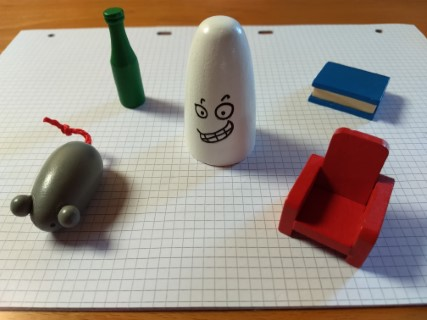
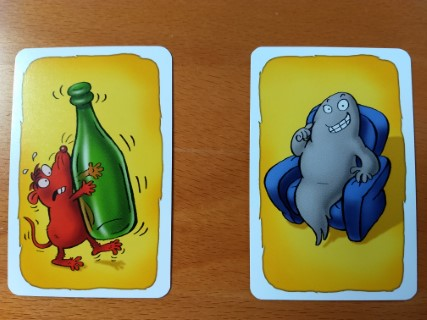

# Laboratorio 13 (Simulazione d'esame)

## Parte di programmazione

Si realizzi un programma Python per determinare le mosse vincenti nel gioco denominato _Fantablitz_. Il gioco è composto
da 5 pezzi fisici e da un mazzo di 60 carte. I pezzi fisici sono illustrati in figura, e rappresentano un fantasma (F)
bianco (b), un topo (T) grigio (g), una bottiglia (B) verde (v), un libro (L) azzurro (a) ed una poltrona (P) rossa (r).
Per brevità, utilizzeremo le iniziali dei nomi degli oggetti e dei colori.

Ciascuna delle 60 carte rappresenta sempre 2 oggetti (in posizioni e dimensioni diverse) che rappresentano due dei 5
pezzi, e sono colorati con due dei 5 colori (non necessariamente quelli dei pezzi fisici).

Il gioco consiste, data una carta del mazzo, nell'identificare il più rapidamente possibile quale sia il pezzo fisico
corrispondente (è garantito che sia uno e solo uno, per ogni carta), applicando le regole seguenti:

- se nella carta è rappresentato uno dei pezzi fisici, **nel colore corretto**, allora il pezzo da identificare è
  quello. Ad esempio, nella carta di sinistra compare la bottiglia verde; poiché il colore della bottiglia è giusto,
  questo sarà il pezzo da scegliere. (Si nota che il topo ha il colore sbagliato, quindi viene ignorato)

- se nella carte i due pezzi fisici sono rappresentati **entrambi nel colore sbagliato**, allora il pezzo da
  identificare sarà l'unico pezzo che è diverso, sia come forma che come colore, dai pezzi illustrati nella carta. Ad
  esempio, nella carta di destra, fantasma e poltrona hanno i colori sbagliati; si dovrà trovare il pezzo che non è il
  fantasma, non è la poltrona, non è grigio, non è blu: in questo caso sarà la bottiglia verde.

Il programma dovrà leggere l'elenco delle 60 carte dal file *carte.txt*, in cui ciascuna carta è rappresentata da una
riga del file. Ciascuna riga è composta da due campi, separati da uno spazio, che descrivono i 2 oggetti presenti sulla
carta. Ciascun oggetto è rappresentato da una stringa di 2 caratteri: l'iniziale del pezzo (FTBLP, in maiuscolo) e
l'iniziale del colore (bgvar, in minuscolo). Se una riga del file non contiene un valore corretto, deve essere ignorata.
Ad esempio, le due carte mostrate in figura sarebbero rappresentate come:

    Tr Bv
    Fg Pa

Il programma dovrà leggere le carte dal file, rimescolare il mazzo, e per ciascuna carta dovrà indicare quale sia il
pezzo fisico da prendere durante il gioco, scrivendo per esteso i nomi delle carte e dei pezzi corrispondenti. Nelle due
carte dell'esempio, il programma dovrà stampare:

    Carta: Topo Rosso + Bottiglia Verde -> Prendere: Bottiglia Verde
    Carta: Fantasma Grigio + Poltrona Azzurro -> Prendere: Bottiglia Verde

